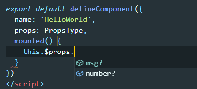
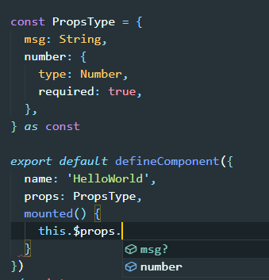

vue3-json-schema-form

## Project setup
```
yarn install
```

### Compiles and hot-reloads for development
```
yarn serve
```

### Compiles and minifies for production
```
yarn build
```

### Run your unit tests
```
yarn test:unit
```

### Lints and fixes files
```
yarn lint
```

### Customize configuration
See [Configuration Reference](https://cli.vuejs.org/config/).

## PropsType

在抽离公共的props类型定义时，即使在属性声明时加了`required: true;`

```typescript
const PropsType = {
  msg: String,
  number: {
    type: Number,
    required: true,
  },
}

export default defineComponent({
  name: 'HelloWorld',
  props: PropsType,
})
```

但是在调用时却发现仍然可以为undefined



因为在定义类型时虽然使用的const但是仍然可以后续对属性进行更改，在`props:PropsType`调用的时候，并不确定PropsType有没有在定义后被更改过

解决方案：在类型定义完后加上`as const`告诉ts这是只读的

```typescript
const PropsType = {
  msg: String,
  number: {
    type: Number,
    required: true,
  },
} as const
```



## h函数

```typescript
import HelloWorld from '@/components/HelloWorld.vue'
import { createApp, defineComponent, h } from 'vue'
// import App from './App.vue'
const logo = require('../src/assets/logo.png') // eslint-disable-line
// 此处如直接通过require引入图片eslint不会通过 

// 参数分别为标签名、属性、子节点
// 原生DOM节点标签名使用字符串'div'， 组件直接使用变量名

const App = defineComponent({
  render() {
    return h('div', { id: 'app' }, [
      h('img', { alt: 'Vue logo', src: logo }),
      h(HelloWorld, {
        msg: 'Welcome to Your Vue.js + TypeScript App',
        number: 12,
      }),
    ])
  },
})

createApp(App).mount('#app')
```

template里面的图片会通过Webpack loader寻址打包，在h函数中不可以

**template   (compilar编译) => h函数(createVNode的封装) => VNode**  

**VNode与真实DOM存在映射关系**

### h函数也可以直接替换成createVNode

```typescript
import HelloWorld from '@/components/HelloWorld.vue'
import { createApp, defineComponent, h, createVNode } from 'vue'
// import App from './App.vue'
const logo = require('../src/assets/logo.png') // eslint-disable-line

const App = defineComponent({
  render() {
    return createVNode('div', { id: 'app' }, [
      createVNode('img', { alt: 'Vue logo', src: logo }),
      createVNode(HelloWorld, {
        msg: 'Welcome to Your Vue.js + TypeScript App',
        number: 12,
      }),
    ])
  },
})

createApp(App).mount('#app')
```

### createVNode前三个参数和h函数一样，后三个参数与优化相关

```typescript
declare function _createVNode(type: VNodeTypes | ClassComponent | typeof NULL_DYNAMIC_COMPONENT, props?: (Data & VNodeProps) | null, children?: unknown, patchFlag?: number, dynamicProps?: string[] | null, isBlockNode?: boolean): VNode;
```

**patchFlag,dynamicProps,isBlockNode**


## setup

setup只执行一次，setup return 的函数每次渲染都执行

## json-schema


## AJV

`yarn add ajv -S`

### format

只针对于string和number 用来验证邮箱，密码，url是否通过

### ajv.addFormat 自定义规则
